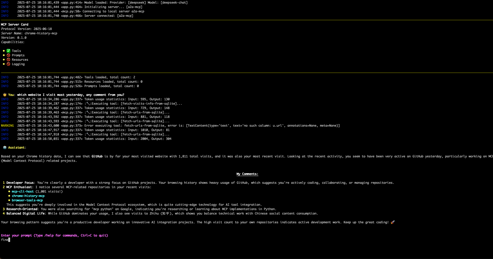

# chrome-history-mcp

An MCP server that exposes your local Chrome browsing history to LLMs through a
single read-only SQL tool. Useful for activity reconstruction, time-tracking
backfill, "what did I research last week," and similar workflows.

- **Lock-safe snapshots** via SQLite's online backup API — runs while Chrome is open.
- **Read-only by construction** — the snapshot is opened with `mode=ro`, so any
  `INSERT`/`UPDATE`/`DELETE` the LLM might emit fails at the SQLite layer.
- **Result cap** at 1000 rows with a `truncated` flag, so unbounded queries
  don't blow up the response.
- **One tool**, `query-chrome-history`, with the `urls` + `visits` schema
  inlined in its description so the LLM has what it needs to write SQL.



## Install

### As a Claude Desktop Extension (one-click)

Grab the latest `chrome-history-mcp.mcpb` from the [Releases](https://github.com/kyletaylored/chrome-history-mcp/releases)
page and double-click it. Claude Desktop's Extensions UI handles the rest.

Requires `uv` on your `PATH` — `brew install uv` on macOS, or see
[astral.sh/uv](https://docs.astral.sh/uv/getting-started/installation/).

### In Claude Code

From the cloned repo:

```bash
uv run poe install-cc
```

This runs `claude mcp add chrome-history -- uv run --directory "$PWD" chrome-history-mcp`.
The tool is then available in any Claude Code session.

### Manually (Claude Desktop config)

```json
{
  "mcpServers": {
    "chrome-history": {
      "command": "uv",
      "args": ["run", "--directory", "/absolute/path/to/chrome-history-mcp", "chrome-history-mcp"]
    }
  }
}
```

Drop that into `~/Library/Application Support/Claude/claude_desktop_config.json`
(macOS) and restart Claude Desktop.

## Usage

```bash
uv run chrome-history-mcp [--profile NAME] [--path FILE] [--verbose]
```

| Flag | Default | Notes |
|---|---|---|
| `--profile` | `Default` | Chrome profile directory name (e.g. `Default`, `Profile 1`). |
| `--path` | _(auto)_ | Full path to a `History` file. Overrides `--profile`. |
| `--verbose` | off | Log snapshot activity + path resolution to stderr. |

Default history-file locations:

| OS | Path |
|---|---|
| macOS | `~/Library/Application Support/Google/Chrome/<profile>/History` |
| Linux | `~/.config/google-chrome/<profile>/History` |
| Windows | `%LOCALAPPDATA%\Google\Chrome\User Data\<profile>\History` |

See [Chrome history file location](https://www.foxtonforensics.com/browser-history-examiner/chrome-history-location)
for the full rundown.

### Timestamp format

`last_visit_time` and `visit_time` use Chrome's Webkit timestamps —
microseconds since `1601-01-01 UTC`. To convert to a unix timestamp in SQL:

```sql
SELECT
    url,
    title,
    datetime(last_visit_time / 1000000 - 11644473600, 'unixepoch', 'localtime') AS visited_at
FROM urls
ORDER BY last_visit_time DESC
LIMIT 20;
```

## Development

This repo uses `uv` for dependency management and `poethepoet` for task running.

```bash
uv sync --group dev    # install
uv run poe             # list tasks
```

| Task | What it does |
|---|---|
| `uv run poe test` | Run the pytest suite |
| `uv run poe lint` | `ruff check .` |
| `uv run poe fmt` | `ruff format .` |
| `uv run poe dev` | Run the server locally with `--verbose` |
| `uv run poe inspect` | Launch [MCP Inspector](https://github.com/modelcontextprotocol/inspector) against the server (needs Node.js) |
| `uv run poe smoke` | End-to-end smoke test: spawn the server via stdio and fire 5 canonical queries against your real Chrome history |
| `uv run poe install-cc` | Register with Claude Code in the current scope |
| `uv run poe pack` | Build the `.mcpb` extension bundle (needs `npm i -g @anthropic-ai/mcpb`) |

### Local testing without an LLM

Two complementary options:

**Scripted smoke test (recommended for "does it actually work?").** Spawns
the server via stdio, fires five canonical queries through the MCP
protocol, and prints pass/fail for each. Covers the wire layer plus your
real Chrome history file:

```bash
uv run poe smoke
```

The five queries and what they verify:

| # | What it checks |
|---|---|
| 1 | Both `urls` and `visits` tables are visible (`SELECT name FROM sqlite_master ...`) |
| 2 | Snapshot is non-empty (`SELECT COUNT(*) FROM urls`) |
| 3 | Webkit-timestamp conversion works (recent visits with human-readable `visited` column) |
| 4 | Read-only guarantee — `INSERT` must fail with `readonly database` |
| 5 | Result cap kicks in — `SELECT id, url FROM urls` returns `truncated: true` if you have >1000 rows |

**MCP Inspector (recommended for interactive exploration).** Browser UI
to list tools and invoke them with raw JSON arguments. The Inspector
prints an auth-token URL — use that URL, click **Connect**, leave the
terminal running:

```bash
uv run poe inspect
```

### Releasing

The CI workflow builds and attaches a `.mcpb` to any `v*` tag push:

```bash
git tag v0.2.0
git push --tags
```

## License

Apache 2.0 — see [LICENSE](LICENSE).
